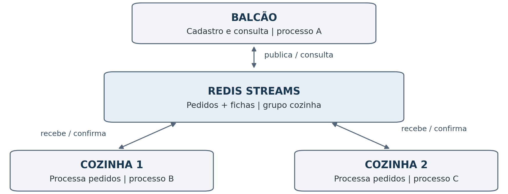

# Guia técnico e experimentos da confeitaria

Este documento reúne a arquitetura, a configuração, os experimentos e as limitações do sistema. Para uma apresentação do projeto e os primeiros passos de instalação, consulte o [README](../README.md). O [relatório acadêmico](relatorio.md) contém a análise da atividade e as respostas às 14 questões.

## Arquitetura



O balcão usa `XADD`. Os trabalhadores usam `XREADGROUP` no mesmo grupo `cozinha`. Cada resultado é registrado em um hash e a mensagem é confirmada com `XACK`. O próprio programa solicita a recuperação de mensagens pendentes com `XAUTOCLAIM`.

## O que foi executado

Execução de referência em **07/09/2026**, Linux, Python **3.12.13**, Redis **6.2.14** e cliente redis-py **5.2.1**. Foram utilizados processos reais separados, conectados por TCP na interface local. O Redis foi iniciado pelo binário disponibilizado pelo pacote opcional `redislite`; não houve simulação do middleware.

| Experimento | Resultado observado |
| --- | --- |
| Cozinha inicialmente desligada | 2 pedidos armazenados e processados ao iniciar o trabalhador |
| Dois trabalhadores | 8 pedidos: 4 para cada trabalhador nesta execução |
| Falha do trabalhador | Pedido sem confirmação recuperado por outro processo |
| Retorno do trabalhador | Nova instância iniciou e processou um novo pedido |
| Reentrega do mesmo pedido | 2 mensagens, mas somente 1 ficha de resultado |
| Falha do Redis | Novo envio recebeu erro; pedido anterior permaneceu após reinício com AOF |

As evidências originais estão em `evidencias/`, com logs e `resumo.json`. Os PIDs, horários e identificadores permitem correlacionar envio, recebimento e confirmação. Em novas execuções, a divisão entre trabalhadores e os identificadores podem mudar.

**Limite da verificação:** o código foi executado em Linux com Redis local. O caminho com Docker/Windows está preparado para reprodução, mas não foi executado nesse ambiente.

## Começar no Windows

Instale o [Python](https://www.python.org/downloads/) e o [Docker Desktop](https://docs.docker.com/desktop/setup/install/windows-install/). Use Python 3.12 para reproduzir a versão principal do teste. Abra o Docker Desktop e aguarde ele iniciar.

Extraia o ZIP. Abra o PowerShell **dentro da pasta principal, que contém o `README.md` e o arquivo `compose.yaml`**.

Crie o ambiente e instale o cliente:

```powershell
py -3 -m venv .venv
.\.venv\Scripts\python.exe -m pip install -r requirements.txt
```

Inicie o middleware e confira se está respondendo:

```powershell
docker compose up -d
docker compose exec redis redis-cli ping
docker compose exec redis redis-server --version
```

A resposta do segundo comando deve ser `PONG`. Na primeira execução, aguarde o download da imagem. Se o serviço ainda não responder, confira `docker compose logs redis` e tente o `ping` novamente.

### Demonstração automática

```powershell
.\.venv\Scripts\python.exe demonstracao.py
```

O roteiro abre e encerra **seus próprios processos** de balcão e cozinha, verifica comunicação, concorrência, falha, retorno e reentrega, e grava os resultados em `evidencias-novas/`. Não modifica as evidências fornecidas. Os dados de cada teste usam um prefixo exclusivo no Redis.

Quando conectado ao Redis do Docker, o roteiro não encerra esse servidor. A quinta etapa fica identificada como não executada; para demonstrá-la, use o roteiro manual de falha do Redis abaixo.

### Demonstração em terminais separados

Abra três PowerShells na pasta do projeto. Não é necessário ativar o ambiente: os comandos usam diretamente o Python da pasta `.venv`.

**Terminal 1 - cozinha:**

```powershell
.\.venv\Scripts\python.exe -m confeitaria.cozinha --nome cozinha-1
```

**Terminal 2 - outra cozinha:**

```powershell
.\.venv\Scripts\python.exe -m confeitaria.cozinha --nome cozinha-2
```

**Terminal 3 - balcão:**

```powershell
.\.venv\Scripts\python.exe -m confeitaria.balcao catalogo
.\.venv\Scripts\python.exe -m confeitaria.balcao novo --cliente Ana --item brigadeiro:10 --item brownie:2
.\.venv\Scripts\python.exe -m confeitaria.balcao lote --quantidade 8
.\.venv\Scripts\python.exe -m confeitaria.balcao listar
.\.venv\Scripts\python.exe -m confeitaria.balcao painel
```

O pedido de Ana deve totalizar **R$ 46,00**. Os logs `ENVIADO`, `RECEBIDO` e `CONFIRMADO` contêm o mesmo `pedido_id`. O registro `CONFIRMADO` informa o total em centavos: `4600` representa R$ 46,00.

`AGUARDANDO_RESULTADO` significa que ainda não há ficha final: o pedido pode estar esperando ou sendo processado. `CONCLUIDO` significa que a ficha foi registrada. O painel distingue histórico, pendências de confirmação e resultados. Consumidores cadastrados no Redis não equivalem necessariamente a processos ativos.

## Experimento manual de falha do trabalhador

Use uma sessão nova, sem consumidores de testes anteriores. Aguarde os pedidos anteriores terminarem e pare as duas cozinhas com `Ctrl+C`, ou pare as cozinhas e utilize um prefixo novo em **todos** os terminais:

```powershell
$env:PREFIXO = 'aula_falha_01'
```

No terminal 1, inicie uma cozinha mais lenta:

```powershell
.\.venv\Scripts\python.exe -m confeitaria.cozinha --nome cozinha-falha --tempo 3 --recuperar-ms 5000
```

No terminal do balcão, envie um pedido:

```powershell
.\.venv\Scripts\python.exe -m confeitaria.balcao novo --cliente Teste --item brownie:2
```

Assim que aparecer `RECEBIDO` na cozinha, pressione `Ctrl+C` nela **antes de aparecer `CONFIRMADO`**. Se não der tempo, repita com outro pedido. Consulte a pendência:

```powershell
docker compose exec redis redis-cli XPENDING aula_falha_01:pedidos cozinha
```

Inicie outra cozinha, mantendo o mesmo prefixo:

```powershell
.\.venv\Scripts\python.exe -m confeitaria.cozinha --nome cozinha-recuperacao
```

Depois de o pedido completar pelo menos cinco segundos sem confirmação, deve aparecer `RECUPERADO` e, depois, `CONFIRMADO`. A recuperação acontece por uma chamada periódica da aplicação ao Redis. Compare o `pedido_id` e o `mensagem_id` antes e depois.

Envie outro pedido enquanto a recuperação é aguardada para mostrar que o balcão e a cozinha ativa continuam trabalhando. Depois reinicie a primeira cozinha e envie novos pedidos para demonstrar seu retorno.

## Experimento manual de falha do Redis

Pare os consumidores e use um prefixo novo em todos os terminais, por exemplo `aula_redis_01`. Envie um pedido enquanto o Redis está ativo. Então interrompa o serviço:

```powershell
docker compose kill -s SIGKILL redis
.\.venv\Scripts\python.exe -m confeitaria.balcao novo --cliente DuranteParada --item brownie:1
```

O novo envio deve retornar erro de conexão. Ele não entrou no Redis; o balcão não possui uma fila local de contingência. Para iniciar o Redis novamente com o mesmo volume:

```powershell
docker compose start redis
docker compose exec redis redis-cli ping
.\.venv\Scripts\python.exe -m confeitaria.balcao listar
```

O pedido gravado antes da interrupção deve continuar no histórico. Inicie uma cozinha para processá-lo. Registre a diferença entre **persistir dados** e **manter o serviço disponível**: este projeto usa um único Redis, sem failover.

## Linux/macOS

Com Docker, utilize o mesmo `compose.yaml`. Para o Python:

```bash
python3 -m venv .venv
.venv/bin/python -m pip install -r requirements.txt
docker compose up -d
.venv/bin/python demonstracao.py
```

Nos demais comandos, substitua `.\.venv\Scripts\python.exe` por `.venv/bin/python`.

Para reproduzir o teste sem Docker em Linux compatível com o pacote opcional:

```bash
.venv/bin/python -m pip install -r requirements-local.txt
.venv/bin/python demonstracao.py --local
```

`--local` procura `redis-server` instalado; se não o encontrar, usa o binário real que vem com `redislite`. Ele inicia o Redis em uma porta local livre e em um diretório temporário, executa inclusive o teste de interrupção do servidor e encerra os processos ao terminar. Logs e resumo são preservados na pasta de saída. A instalação opcional depende da disponibilidade de um pacote compatível com o sistema.

## Configuração e contrato

| Item | Valor |
| --- | --- |
| Plataforma testada | Redis 6.2.14; os comandos usados exigem Redis 6.2 ou superior |
| Imagem Docker | `redis:6.2.14-alpine`, fixada para a reprodução didática |
| Cliente | `redis==5.2.1` |
| Endpoint padrão | `redis://127.0.0.1:6379/0` |
| Transporte | TCP; protocolo Redis RESP, sem HTTP |
| Mensagem de negócio | JSON UTF-8 no campo `json` do stream |
| Stream padrão | `confeitaria:pedidos` |
| Grupo | `cozinha` |
| Resultados | hash `confeitaria:resultados`, indexado por `pedido_id` |
| Persistência | AOF, `appendonly yes`, `appendfsync always` |
| Recuperação | `XAUTOCLAIM`, após 5.000 ms sem confirmação, consultado pelo trabalhador |
| Consumo | Uma mensagem por leitura; nomes de consumidores distintos |

`REDIS_URL` altera o endereço do servidor; `PREFIXO` separa os dados de cada execução. Use as mesmas variáveis em todos os processos que devem cooperar. O endpoint é explícito: não existe descoberta automática de serviços neste projeto.

Um pedido contém `versao`, `pedido_id`, `cliente`, `itens` e `criado_em`. Cada item contém um produto do catálogo e uma quantidade inteira de 1 a 100. O produtor valida esses campos antes do envio; o consumidor valida novamente. O JSON é definido pela aplicação; o cliente redis-py cuida do protocolo e da conexão com o Redis.

## Entrega, persistência e limites

- A confirmação só ocorre depois do registro do resultado. `XACK` remove a pendência do grupo; não apaga a mensagem do histórico.
- Mensagens não confirmadas podem ser reentregues. `HSETNX` e `XACK` são executados num pequeno script Lua, de forma atômica, para não gerar duas fichas para o mesmo identificador.
- Isso não garante execução exatamente uma vez de pagamentos, impressão física ou outros efeitos externos. Esses efeitos não fazem parte desta aplicação.
- Consumidores do mesmo grupo competem pelos pedidos. Não existe garantia de uma divisão exatamente igual nem de ordem global de conclusão.
- O intervalo de recuperação precisa superar o tempo normal de trabalho. Nesta versão não há renovação periódica do tempo de posse; pausas muito longas podem causar processamento repetido, embora a ficha seja protegida contra duplicação.
- AOF com `always` sincroniza as gravações no disco antes da resposta, com custo de desempenho. A recuperação observada no teste não prova resistência a perda do disco ou a todas as falhas de infraestrutura.
- Há um único servidor Redis. Réplicas, Sentinel, Cluster e autenticação/TLS não foram configurados. A porta do compose é publicada apenas em `127.0.0.1`, para o laboratório local.
- O histórico e os resultados não têm expiração neste exercício; numa operação contínua seria necessário definir retenção e monitorar memória. Não se deve remover mensagens ainda necessárias à recuperação.

## Arquivos

| Arquivo/pasta | Função |
| --- | --- |
| `confeitaria/balcao.py` | Cadastro, envio e consulta |
| `confeitaria/cozinha.py` | Processamento, confirmação e recuperação |
| `confeitaria/comum.py` | Catálogo, validação, conexão e logs |
| `compose.yaml` | Redis com persistência em volume |
| `demonstracao.py` | Experimentos e verificações com processos reais |
| `evidencias/` | Logs originais e resumo da execução de referência |
| `docs/relatorio.md` | Texto do relatório e respostas às 14 questões |
| `docs/Relatorio_Confeitaria_Redis_Streams.docx` | Relatório editável, com diagrama e evidências |
| `docs/roteiro-apresentacao.md` | Explicação e sequência para apresentar |
| `docs/entrega-github.md` | Organização da entrega no GitHub |

Para encerrar o ambiente Docker, use `docker compose down`. O volume de dados permanece. Não é necessário remover os dados para repetir a demonstração automática, porque cada teste usa prefixos novos.

## Referências

- [Redis: XADD](https://redis.io/docs/latest/commands/xadd/)
- [Redis: XREADGROUP](https://redis.io/docs/latest/commands/xreadgroup/)
- [Redis: XACK](https://redis.io/docs/latest/commands/xack/)
- [Redis: XAUTOCLAIM](https://redis.io/docs/latest/commands/xautoclaim/)
- [Redis: persistência](https://redis.io/docs/latest/operate/oss_and_stack/management/persistence/)
- [Redis: scripts Lua](https://redis.io/docs/latest/develop/programmability/eval-intro/)
- [Redis: cliente Python](https://redis.io/docs/latest/develop/clients/redis-py/)

Documentação consultada em 07/09/2026. As páginas atuais também descrevem recursos mais novos; este projeto usa somente os comandos disponíveis na versão registrada.
